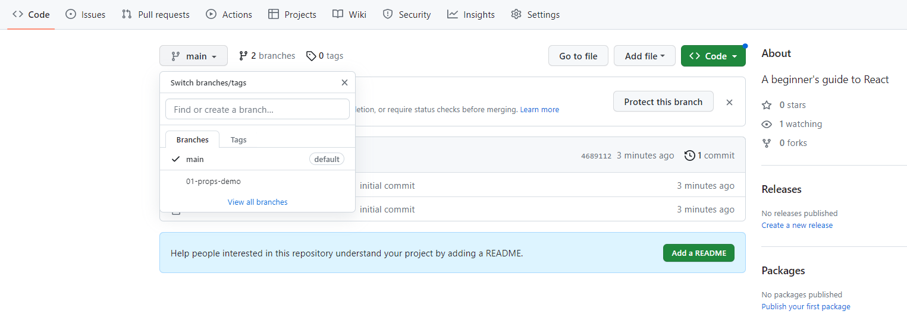
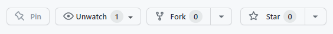

# Beginners guide to React

Welcome!

This repo is designed as a beginner's guide to some foundational principles which are available with React.  This material is intended to supplement it's associated online tutorial.

## Usage

Each tutorial in this series is organized into a dedicated **branch**.  You can select the appropriate branch from the box depicting the node tree with the drop down arrow, as pictured below.

Each branch will have a **code** folder containing the source code for that topic

## Using this repo

Feel free to fork this repo using the fork icon in the upper right corner of the repo.

Alternatively, for referene, code can be copy and pasted directly from the applicable file.  Using the green dropdown **Code** button, each **branch** can be downloaded as a zip file as well.

## Running your code locally

To run this code, you must  have Node.js installed.  If you do not have Node.js installed, you can do so [here](https://nodejs.org/en).

Once you have forked and cloned the repo, or downloaded a zip file, navigate to the applicable folder from your command prompt, or terminal.

Run the command **npm install**.  This will install the associated dependencies.  This will also create a `/node_modules folder`.

### Have Fun!